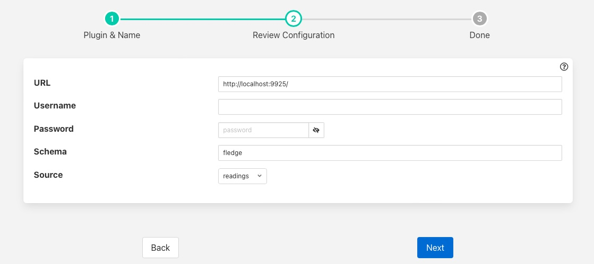

.. Images

.. Links
.. |HarperDB| raw:: html

   <a href="https://harperdb.io" target="_blank">HarperDB</a>

HarperDB
========

The *fledge-north-harperdb* plugin sends data from Fledge to the |HarperDB| database.  HarperDB is a geo-distributed database with hybrid SQL & NoSQL functionality in one powerful tool, accessed via a REST API. Each asset that is read by Fledge is written to a separate table within the specified HarperDB schema. The plugin will support both local installations and cloud installations of HarperDB.

The configuration of the *HarperDB* plugin requires a few simple configuration parameters to be set.

+----------+
| |harper| |
+----------+

  - **URL**: The URL of the HarperDB database that will be used to store the data sent from Fledge. This may be either an HTTP or HTTPS URL

  - **Username**: The username to use when authenticating with the HarperDB database.

  - **Password**: The password of the user that will be used to store the data in HarperDB.

  - **Schema**: The name of the schema in the HarperDB database in which the tables will be stored.

  - **Source**: The source of the Fledge data to store in the HarperDB database; Readings or Fledge Statistics.
